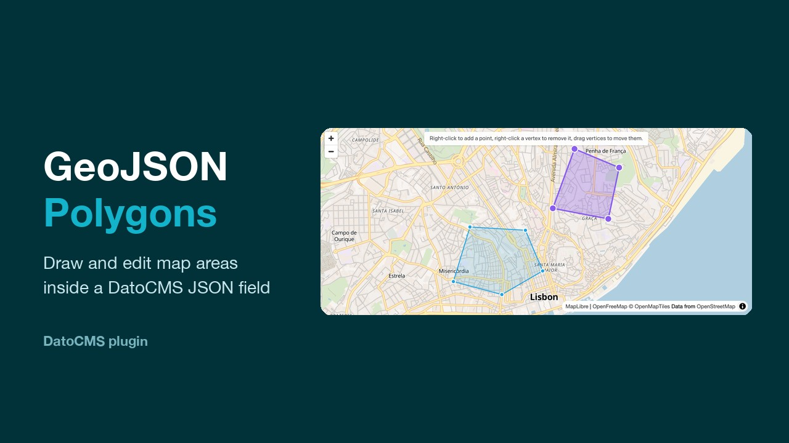
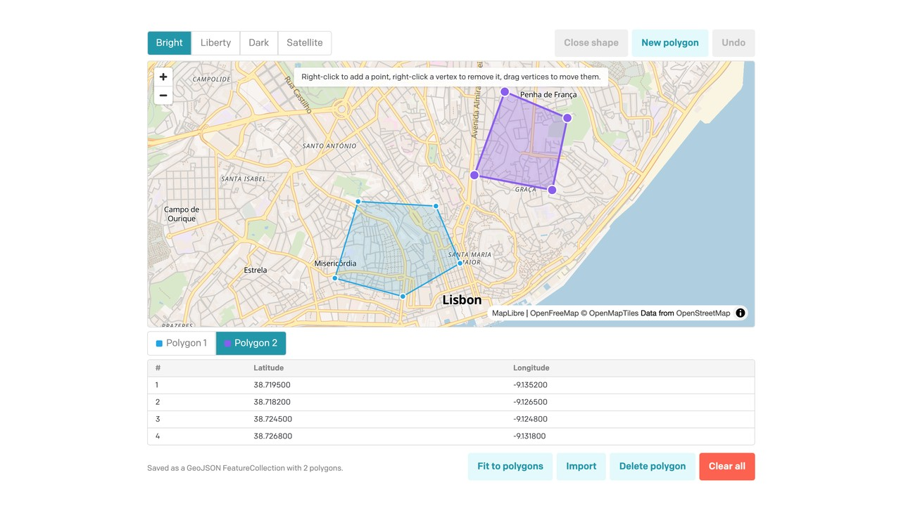

# GeoJSON Polygons for DatoCMS



Draw and edit polygons on a map inside a DatoCMS JSON field. Editors click on an inline map to outline areas such as delivery zones, venues, neighborhoods, or campus boundaries. The field stores standard GeoJSON that any frontend can render.

The map uses [MapLibre GL](https://maplibre.org/) with [OpenFreeMap](https://openfreemap.org/) tiles, so no API key or billing account is needed.

## What editors see



- **Right-click** the map to add a point. On touch devices, **tap** instead.
- **Drag** a vertex to move it. **Right-click** a vertex to remove it.
- Right-clicking near an edge of a closed polygon inserts a point on that edge.
- **Close shape** turns three or more points into a polygon. Only closed polygons are saved.
- **New polygon** starts another shape. A field can hold as many polygons as you need.
- Click a polygon, or its button below the map, to select it. The table lists the selected polygon's latitude and longitude pairs.
- **Undo** reverts the last change, one step at a time, including drags and deletions.
- **Import** accepts GeoJSON (`FeatureCollection`, `Feature`, `Polygon`, `MultiPolygon`, `LineString`), raw coordinate arrays, or one `longitude, latitude` pair per line, with a blank line between shapes.
- Switch between the Bright, Liberty, Dark, and Satellite basemaps.

Scroll-wheel zoom needs Ctrl or ⌘ held down, and touch panning needs two fingers, so scrolling the record form never moves the map by accident.

## Stored value

The field saves a GeoJSON [`FeatureCollection`](https://datatracker.ietf.org/doc/html/rfc7946#section-3.3) of `Polygon` features:

```json
{
  "type": "FeatureCollection",
  "features": [
    {
      "type": "Feature",
      "properties": {},
      "geometry": {
        "type": "Polygon",
        "coordinates": [
          [
            [-9.1508, 38.7105],
            [-9.1432, 38.7089],
            [-9.1368, 38.7118],
            [-9.1482, 38.7172],
            [-9.1508, 38.7105]
          ]
        ]
      }
    }
  ]
}
```

- Positions are `[longitude, latitude]`, as the GeoJSON spec requires.
- Each ring is closed: its first and last positions are equal.
- Rings are counter-clockwise (RFC 7946). Clockwise drawings are reversed on save.
- When every polygon is removed, the field is set to `null`.
- Holes are not supported. When you import a polygon that has holes, only its outer ring is kept.

Because this is plain GeoJSON, you can pass it straight to MapLibre, Mapbox, Leaflet, Google Maps Data layers, Turf.js, or PostGIS.

## Setup

1. Install the plugin from the DatoCMS Marketplace, or add it as a private plugin using `https://plugins-cdn.datocms.com/datocms-plugin-geojson-polygons@latest/dist/index.html`.
2. Optionally, open the plugin settings to choose the default map center, zoom, and basemap. These apply when a field is empty. The default is Lisbon at zoom 12.
3. Add a **JSON** field to a model. Under **Presentation**, choose the **GeoJSON polygons** editor.

Localized fields work too: each locale keeps its own polygons.

## Map data and licenses

- The Bright, Liberty, and Dark basemaps come from [OpenFreeMap](https://openfreemap.org/), using © [OpenStreetMap](https://www.openstreetmap.org/copyright) contributors data.
- Satellite imagery comes from [EOX Sentinel-2 cloudless](https://s2maps.eu/), licensed [CC BY-NC-SA 4.0](https://creativecommons.org/licenses/by-nc-sa/4.0/). This license does not allow commercial use, so check that it fits your project before using that basemap.

## Development

This project uses Node 22.12 or newer and pnpm 12, which you can enable with `corepack enable`.

```bash
pnpm install   # also copies the MapLibre worker into public/
pnpm dev       # http://localhost:5173, add as a private plugin in DatoCMS
pnpm check     # oxlint (no warnings allowed), vitest, and the production build
```

MapLibre runs its tile parsing in a module worker. `scripts/copy-maplibre-worker.mjs` copies `maplibre-gl-worker.mjs` and `maplibre-gl-shared.mjs` from the `maplibre-gl` package into `public/`. Vite then ships them next to `index.html`, and the worker URL is resolved relative to the document, so it also works from the versioned plugin CDN.

### Stack

- [DatoCMS Plugin SDK](https://www.datocms.com/docs/plugin-sdk) 2.5 and `datocms-react-ui` 2.5
- React 19, TypeScript 7 (strict), Vite 8
- MapLibre GL 6
- Oxlint and Vitest

### Releasing

Publishing a GitHub release runs `.github/workflows/publish.yml`, which checks the project and publishes it to npm with the `NPM_TOKEN` repository secret. DatoCMS picks up new versions for the Marketplace automatically.

## Credits

The drawing, editing, and import logic is adapted from [GeoJSON Polygon Builder](https://github.com/rodrigobarona/GeoJSON-Viewer), a standalone Next.js tool ([live demo](https://geojson-polygon-builder.vercel.app/)).

## License

[MIT](LICENSE)
